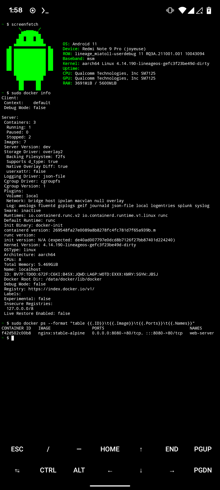

# Docker supported kernel for LineageOS Miatoll



Output of the [`check-config.sh`](https://github.com/moby/moby/blob/master/contrib/check-config.sh) script : 

```yml
Generally Necessary:
- cgroup hierarchy: properly mounted [/dev]
- CONFIG_NAMESPACES: enabled
- CONFIG_NET_NS: enabled
- CONFIG_PID_NS: enabled
- CONFIG_IPC_NS: enabled
- CONFIG_UTS_NS: enabled
- CONFIG_CGROUPS: enabled
- CONFIG_CGROUP_CPUACCT: enabled
- CONFIG_CGROUP_DEVICE: enabled
- CONFIG_CGROUP_FREEZER: enabled
- CONFIG_CGROUP_SCHED: enabled
- CONFIG_CPUSETS: enabled
- CONFIG_MEMCG: enabled
- CONFIG_KEYS: enabled
- CONFIG_VETH: enabled
- CONFIG_BRIDGE: enabled
- CONFIG_BRIDGE_NETFILTER: enabled
- CONFIG_IP_NF_FILTER: enabled
- CONFIG_IP_NF_TARGET_MASQUERADE: enabled
- CONFIG_NETFILTER_XT_MATCH_ADDRTYPE: enabled
- CONFIG_NETFILTER_XT_MATCH_CONNTRACK: enabled
- CONFIG_NETFILTER_XT_MATCH_IPVS: enabled
- CONFIG_NETFILTER_XT_MARK: enabled
- CONFIG_IP_NF_NAT: enabled
- CONFIG_NF_NAT: enabled
- CONFIG_POSIX_MQUEUE: enabled
- CONFIG_NF_NAT_IPV4: enabled
- CONFIG_NF_NAT_NEEDED: enabled

Optional Features:
- CONFIG_USER_NS: enabled
- CONFIG_SECCOMP: enabled
- CONFIG_SECCOMP_FILTER: enabled
- CONFIG_CGROUP_PIDS: enabled
- CONFIG_MEMCG_SWAP: enabled
- CONFIG_MEMCG_SWAP_ENABLED: enabled
    (cgroup swap accounting is currently enabled)
- CONFIG_IOSCHED_CFQ: enabled
- CONFIG_CFQ_GROUP_IOSCHED: enabled
- CONFIG_BLK_CGROUP: enabled
- CONFIG_BLK_DEV_THROTTLING: enabled
- CONFIG_CGROUP_PERF: enabled
- CONFIG_CGROUP_HUGETLB: enabled
- CONFIG_NET_CLS_CGROUP: enabled
- CONFIG_CGROUP_NET_PRIO: enabled
- CONFIG_CFS_BANDWIDTH: enabled
- CONFIG_FAIR_GROUP_SCHED: enabled
- CONFIG_RT_GROUP_SCHED: enabled
- CONFIG_IP_NF_TARGET_REDIRECT: enabled
- CONFIG_IP_VS: enabled
- CONFIG_IP_VS_NFCT: enabled
- CONFIG_IP_VS_PROTO_TCP: enabled
- CONFIG_IP_VS_PROTO_UDP: enabled
- CONFIG_IP_VS_RR: enabled
- CONFIG_SECURITY_SELINUX: enabled
- CONFIG_SECURITY_APPARMOR: enabled
- CONFIG_EXT4_FS: enabled
- CONFIG_EXT4_FS_POSIX_ACL: enabled
- CONFIG_EXT4_FS_SECURITY: enabled
- Network Drivers:
  - "overlay":
    - CONFIG_VXLAN: enabled
    - CONFIG_BRIDGE_VLAN_FILTERING: enabled
      Optional (for encrypted networks):
      - CONFIG_CRYPTO: enabled
      - CONFIG_CRYPTO_AEAD: enabled
      - CONFIG_CRYPTO_GCM: enabled
      - CONFIG_CRYPTO_SEQIV: enabled
      - CONFIG_CRYPTO_GHASH: enabled
      - CONFIG_XFRM: enabled
      - CONFIG_XFRM_USER: enabled
      - CONFIG_XFRM_ALGO: enabled
      - CONFIG_INET_ESP: enabled
      - CONFIG_INET_XFRM_MODE_TRANSPORT: enabled
  - "ipvlan":
    - CONFIG_IPVLAN: enabled
  - "macvlan":
    - CONFIG_MACVLAN: enabled
    - CONFIG_DUMMY: enabled
  - "ftp,tftp client in container":
    - CONFIG_NF_NAT_FTP: enabled
    - CONFIG_NF_CONNTRACK_FTP: enabled
    - CONFIG_NF_NAT_TFTP: enabled
    - CONFIG_NF_CONNTRACK_TFTP: enabled
- Storage Drivers:
  - "aufs":
    - CONFIG_AUFS_FS: missing
  - "btrfs":
    - CONFIG_BTRFS_FS: enabled
    - CONFIG_BTRFS_FS_POSIX_ACL: enabled
  - "devicemapper":
    - CONFIG_BLK_DEV_DM: enabled
    - CONFIG_DM_THIN_PROVISIONING: enabled
  - "overlay":
    - CONFIG_OVERLAY_FS: enabled
  - "zfs":
    - /dev/zfs: missing
    - zfs command: missing
    - zpool command: missing

Limits:
- /proc/sys/kernel/keys/root_maxkeys: 1000000
```
